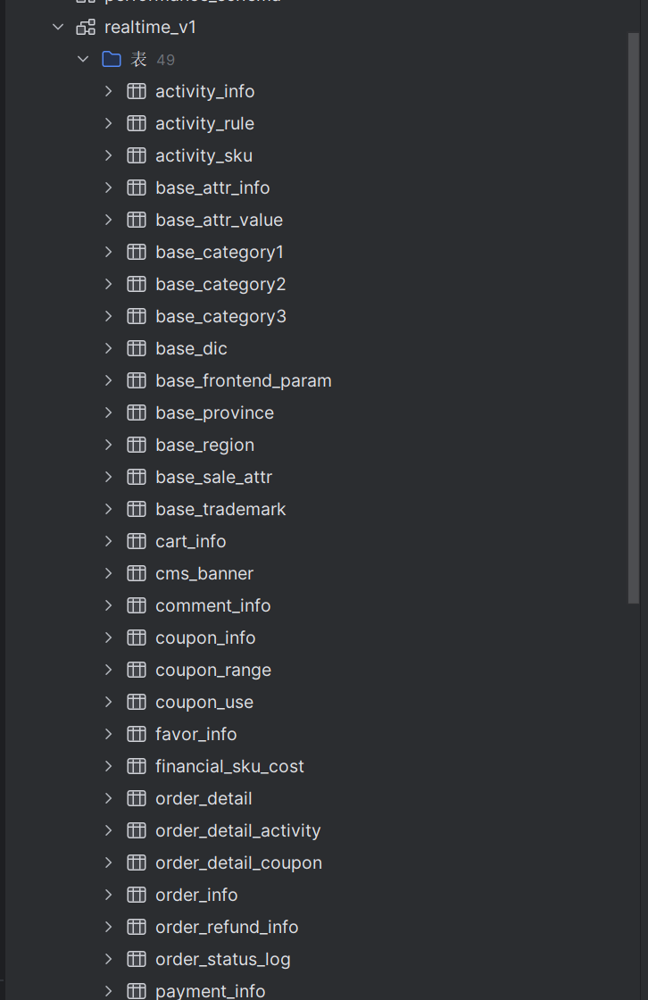
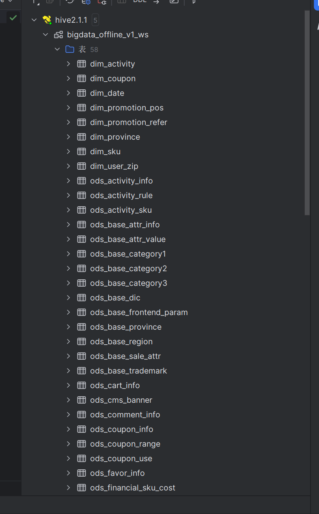
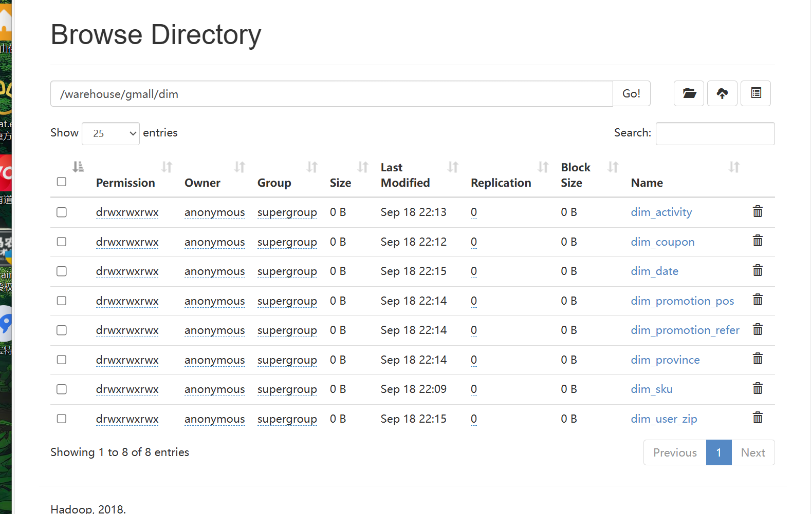
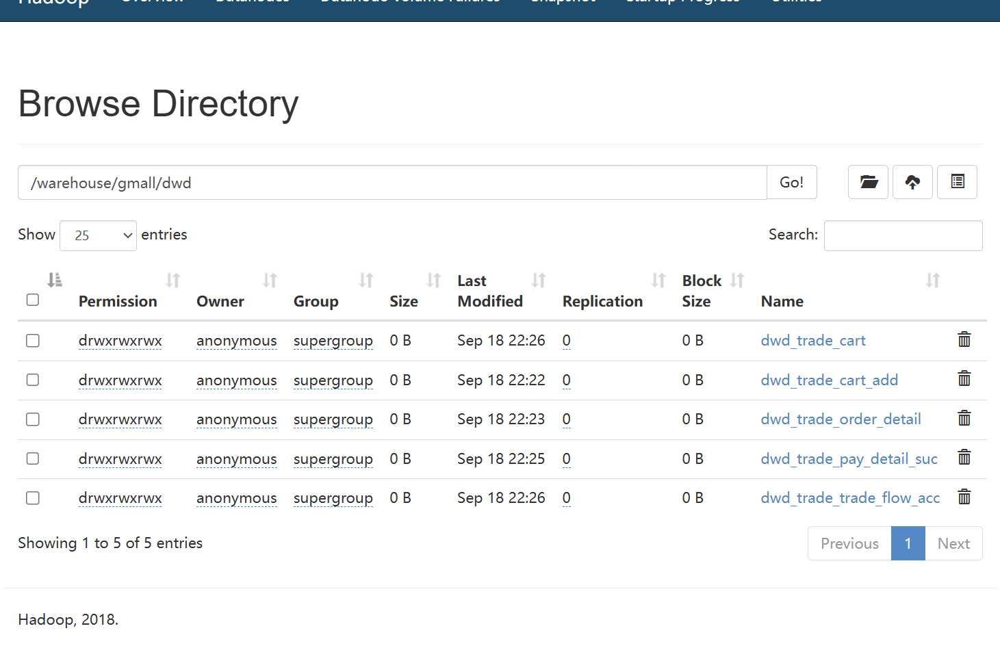

[//]: # (通过mysql里的realtime_v1表数据库连通hive里realtime_v1_hive的表数据中)
>
>

[//]: # (通过使用hive里的bigdata_offline_v1_ws数据库连接通dim)
>
>

[//]: # (通过使用hive里的bigdata_offline_v1_ws数据库连接通dwd)
>
>

[//]: # (通过使用hive里的bigdata_offline_v1_ws数据库连接通dws)

[//]: # (通过使用hive里的bigdata_offline_v1_ws数据库连接通ads)
